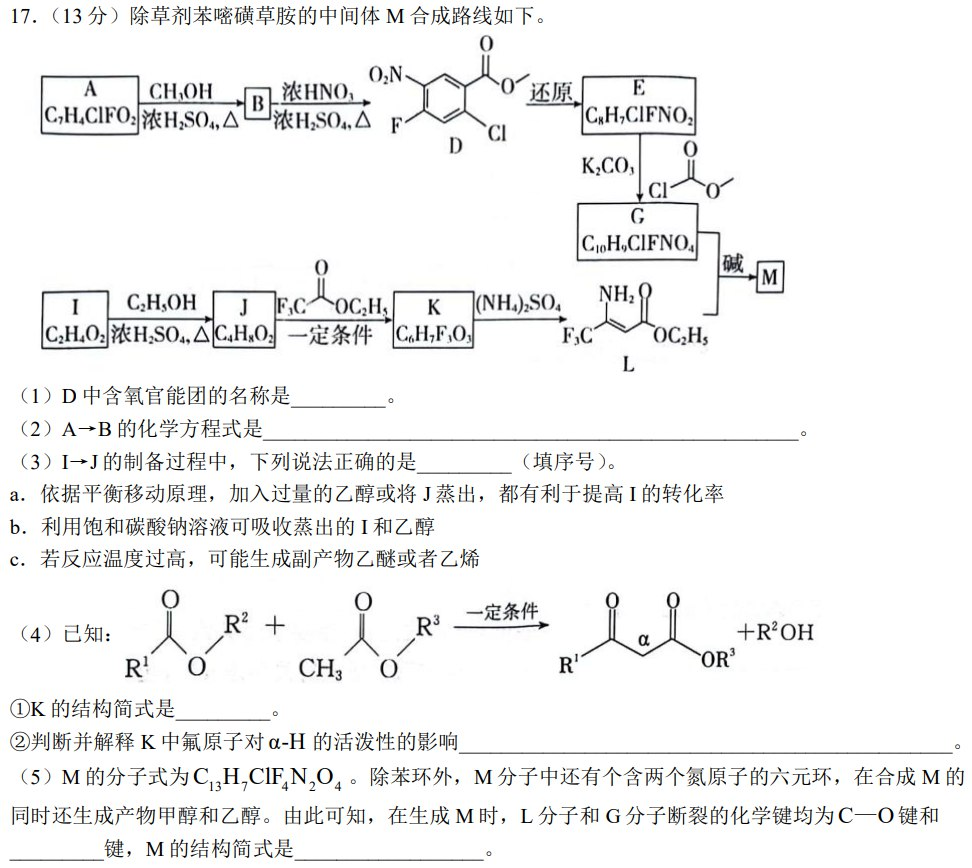
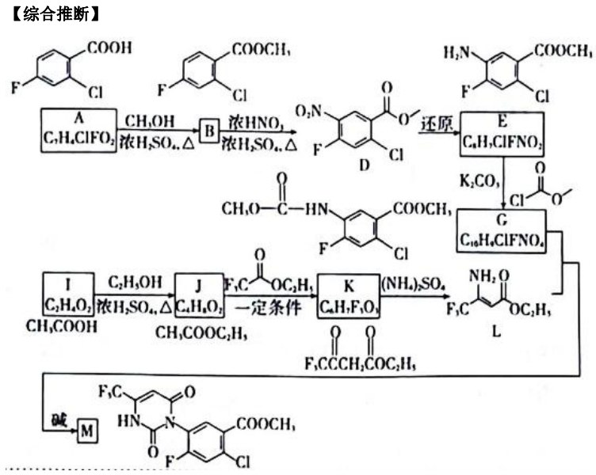
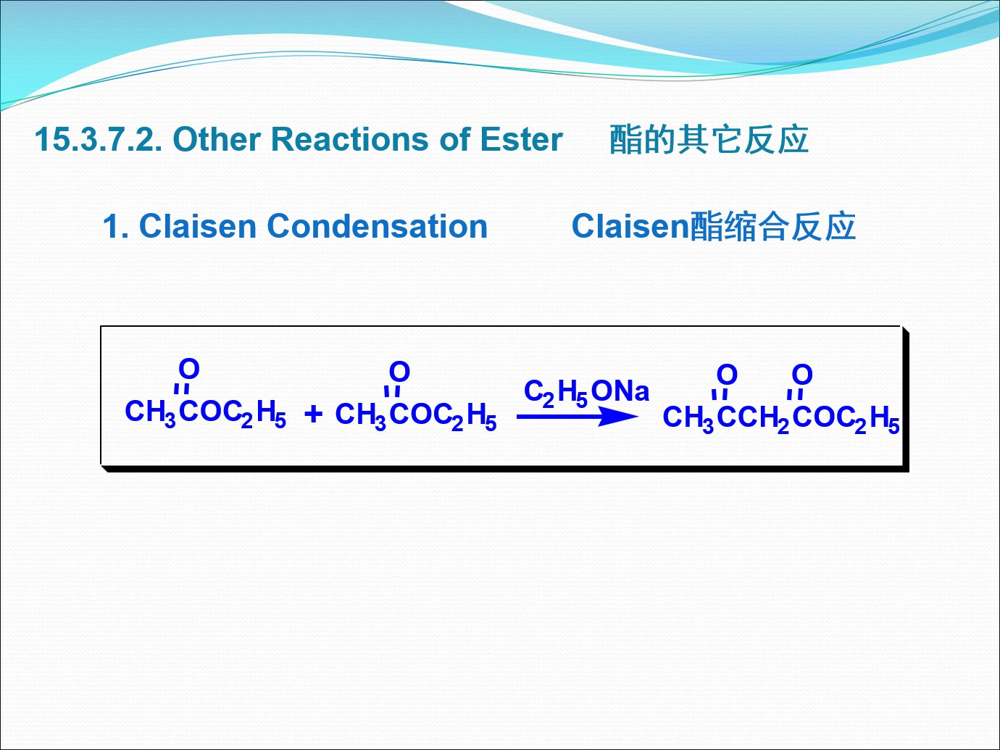
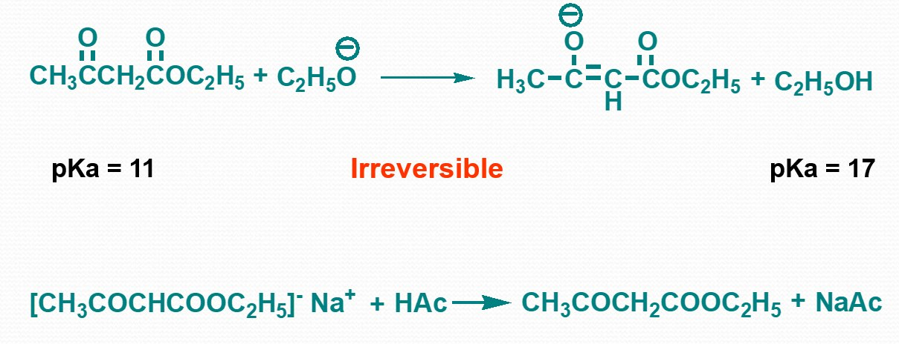
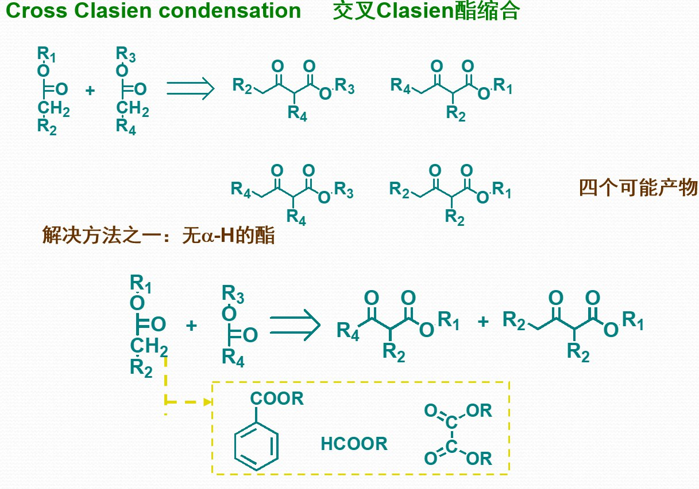

J->K发生了**克莱森酯缩合反应**(Claisen Condensation)

这里的一定条件就是**醇钠**(最后一步形成烯醇盐的质子转移是不可逆的)

为什么信息反应没有副产物?因为三氟乙酸乙酯**没有α-H**,无法形成碳负离子

然后,$(NH_4)_2SO_4$中游离的$NH_3$对羰基进行**亲核进攻**(三氟甲基增加了羰基碳的正电性,从而增加了其亲电性),形成四面体中间体,然后脱水形成**亚胺**(=N)结构.为了形成共轭体系,亚胺互变异构成为**烯胺**(L).

最后生成M的反应,经过了两次胺对羰基的**亲核进攻**,第一次脱去一分子乙醇,第二次脱去一分子甲醇.
1. 第一步：脱去乙醇 ($C_2H_5OH$) —— 酰胺化/亲核取代反应位点：G 分子上的氨基（$-NH-$）进攻 L 分子上的酯基（$-COOC_2H_5$）。原理：这是一个典型的亲核取代反应。由于 L 是 $\beta$-氨基烯酸酯，其酯基碳原子具有较高的亲核受体活性。G 上的氨基作为亲核试剂进攻该酯基，脱去一分子乙醇，形成酰胺键。此时，两个碎片已经连为一体，形成了链状中间体。
   
2. 第二步：脱去甲醇 ($CH_3OH$) —— 环化脱离反应位点：中间体另一端的氮原子进攻 G 部分原有的氨基甲酸甲酯基团（$-NH-COOCH_3$）。原理：在碱性或成环条件下，分子内发生进一步的亲核攻击，进攻 G 端的酯基碳。此时脱去一分子甲醇，从而关环形成嘧啶酮环系（即产物 M 的核心）。