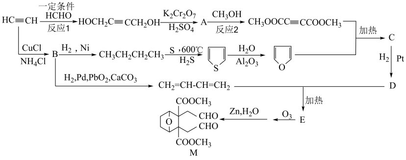
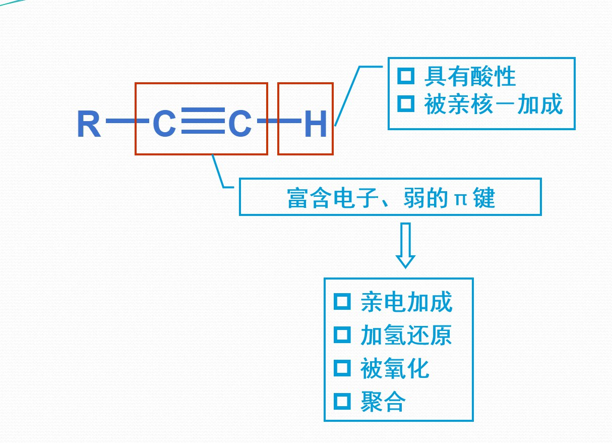
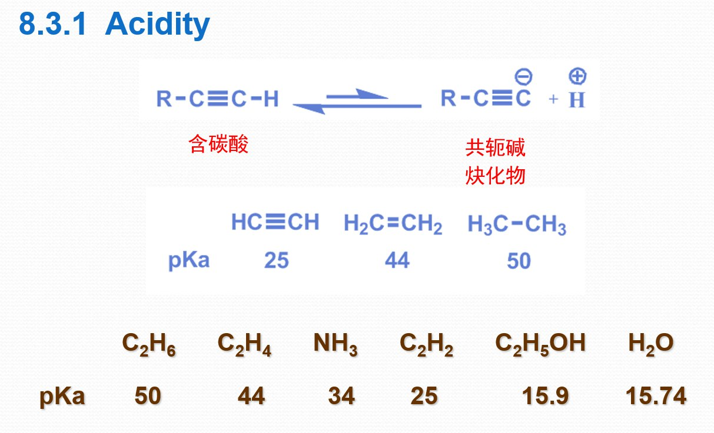
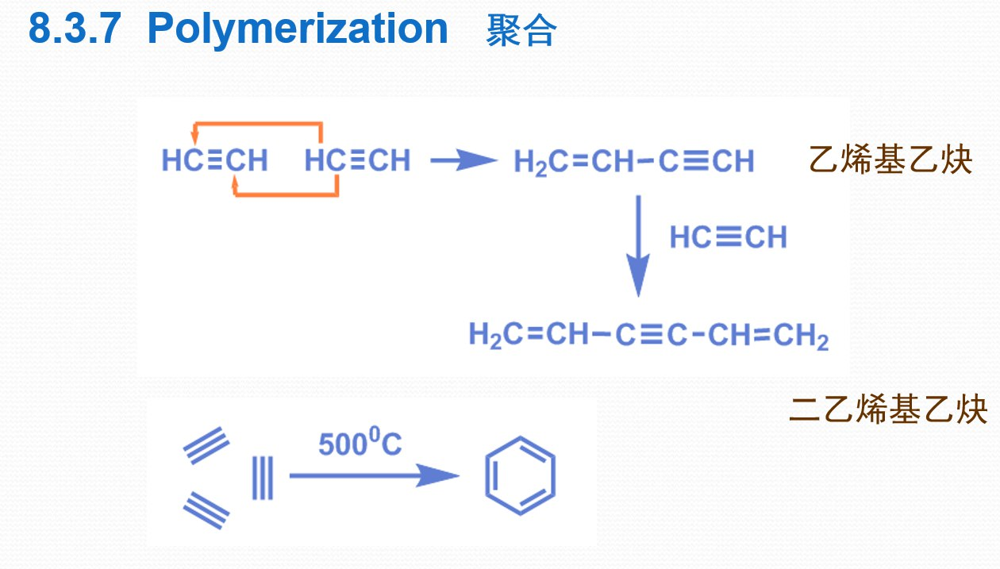
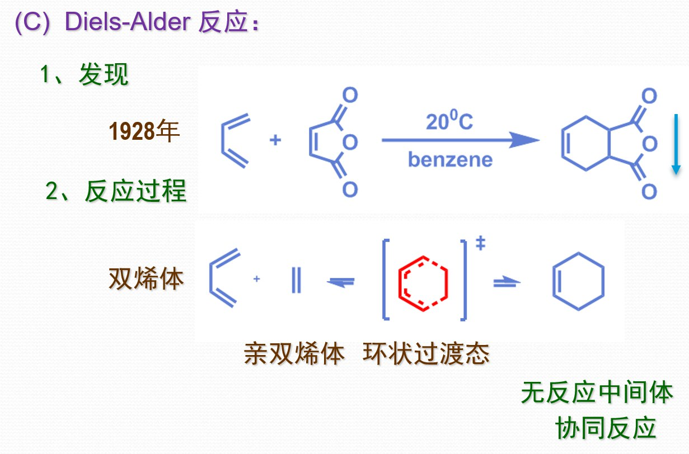
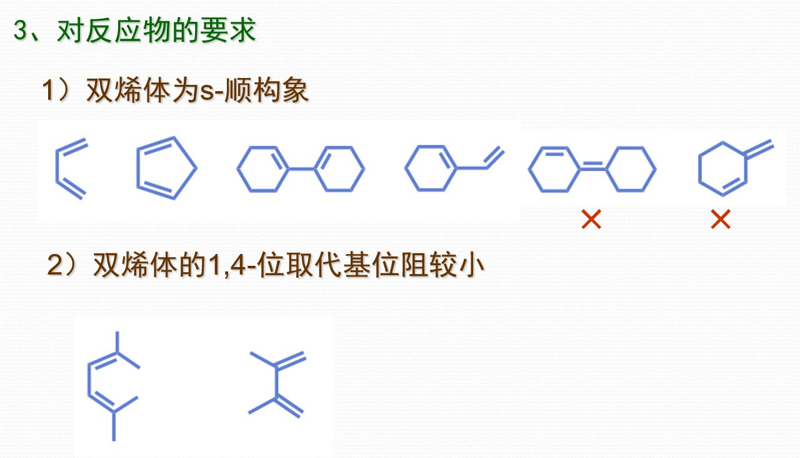
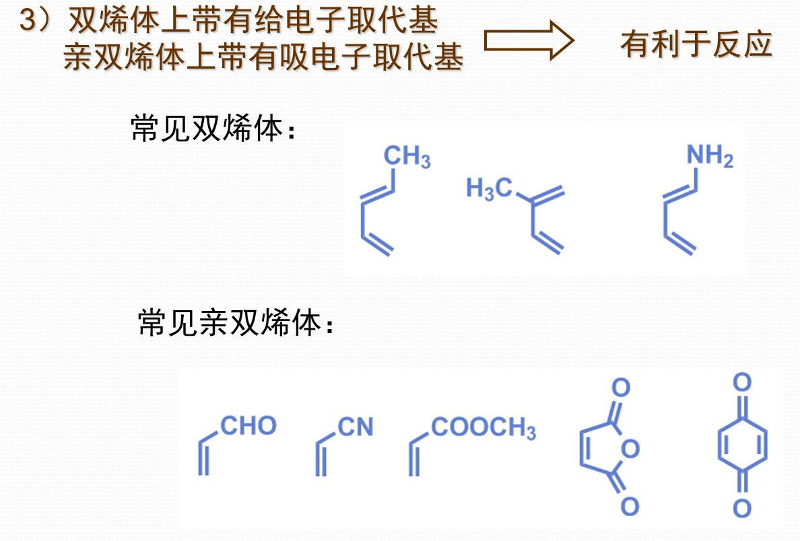
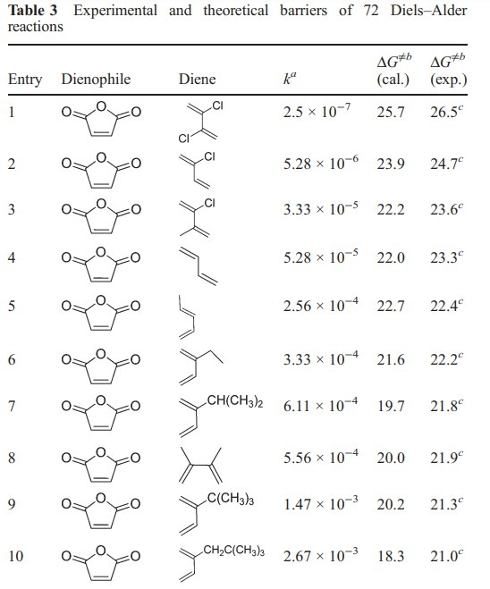
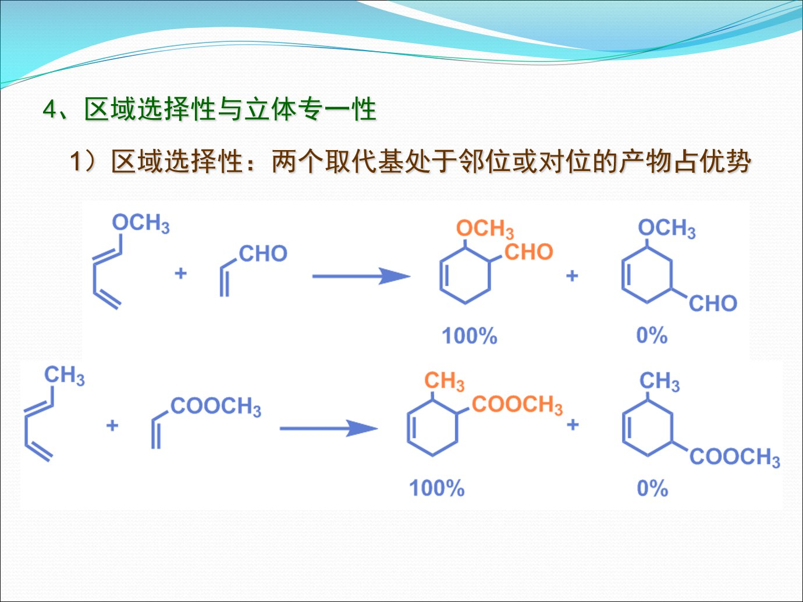
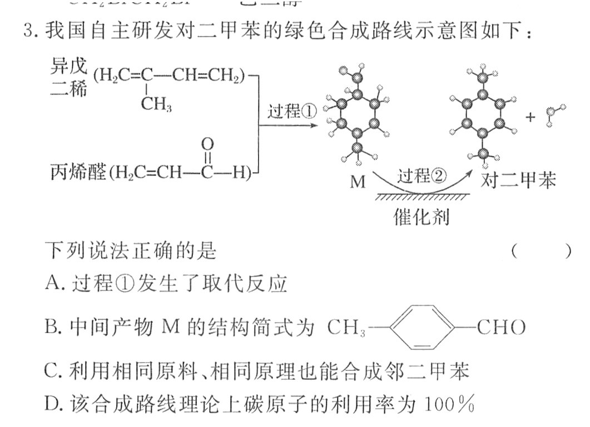

乙炔是重要的化工基础原料，常用于合成有机工业产品**M**。合成路线如下：

已知：i. **炔烃**像**烯烃**一样，可以发生类似上述反应
ii. **RCH=CHR'** → (O₃, Zn, H₂O) → **RCHO** + **R'CHO**

(1) **HOCH₂C=CCCH₂OH** 含有的官能团的名称是  

(2) **反应1**的反应类型是  

(3) **反应2**的化学方程式是  

(4) 同一个碳原子形成两个碳碳双键不稳定。链烃**B**的分子式为**C₄H₄**，结构简式是  

(5) 由**C**合成**M**要经历**C→D→E→M**三步反应。  
   ① 中间产物**E**的结构简式是  
   ② 该过程中**C→D**选择催化氢化时还有副产物**F**、**F**与**D**互为同分异构体。若**F**按合成路线继续反应，最终将得到**M**的同分异构体**N**。则**N**的结构简式是  
   ③ 结合共价键的极性，从化学键的断裂和形成的角度描述反应1发生的过程：

本题考查了对**炔烃**和**共轭二烯烃**性质的了解:

炔烃的碳原子为***sp***杂化,电负性大,酸性强于烷烃和炔烃.

由于炔烃具有**酸性**,炔烃可以发生(4)的**亲电加成反应**(类比乙酸与乙烯加成得到乙酸乙酯),和(6)的**亲核进攻反应**.

合成C的反应就是大名鼎鼎的~~奥尔斯帝德~~**狄尔斯-阿尔德**反应:
>狄尔斯–阿尔德反应（英语：Diels–Alder reaction；狄尔斯又译作第尔斯，阿尔德又译作阿德尔、阿德耳），又叫双烯加成反应，是一种有机反应（具体而言是一种环加成反应），共轭双烯与取代烯烃（一般称为亲双烯体）反应生成取代环己烯[1][2][3]。即使新形成的环之中的一些原子不是碳原子，这个反应也可以继续进行。一些狄尔斯–阿尔德反应是可逆的，这样的环分解反应叫做逆狄尔斯–阿尔德反应或逆Diels–Alder反应--wikipedia

这里**亲双烯体**上的酯基有**诱导吸电子效应**(-I),有利于**DA反应**

**双烯体**呋喃(Furan)的氧原子有**共轭给电子效应**(+M),并且面临[五元环的环张力](https://www.zhihu.com/question/595101485),也有利于**DA反应**

C->D的还原反应中,2-3位形成的碳碳双键不在共轭体系中,更容易被选择还原.

### DA反应的空间选择性

>Diels-Alder（D-A）反应的区域选择性（Regioselectivity）是指当双烯体（Diene）和亲双烯体（Dienophile）均不对称时，产物中取代基的相对位置具有高度倾向性的现象。

# Gemini

要完整解释这一现象，最严谨的逻辑链条是：**取代基的诱导/共轭效应 $\rightarrow$ 分子轨道的极化 $\rightarrow$ 前线轨道系数（Coefficient）的匹配**。

---

### 1. 核心理论模型：前线轨道理论 (FMO)

根据 FMO 理论，D-A 反应主要由双烯体的 **HOMO**（最高占据轨道）与亲双烯体的 **LUMO**（最低未占据轨道）相互作用驱动。

根据二阶微扰理论，反应的活化能取决于轨道重叠的程度。其简化公式为：

$$\Delta E \approx \sum \frac{(C_{diene}^i \cdot C_{dienophile}^j \cdot \beta)^2}{E_{HOMO} - E_{LUMO}}$$

其中 $C$ 是原子轨道系数。结论非常明确：**轨道系数最大的两个碳原子会优先成键，轨道系数次大的两个碳原子随后成键。**

---

### 2. 取代基对轨道系数的影响（推论过程）

#### (1) 双烯体（Diene）的极化

双烯体通常带有**给电子基团 (EDG)**，如 $-\text{CH}_3, -\text{OR}, -\text{NR}_2$。

* **1-取代双烯体**：给电子基团通过共轭效应，使得 **4-位** 的轨道系数显著增大。
* **2-取代双烯体**：给电子基团使得 **1-位** 的轨道系数显著增大（注：这里的 1-位指远离取代基那一侧的端基碳）。

#### (2) 亲双烯体（Dienophile）的极化

亲双烯体通常带有**吸电子基团 (EWG)**，如 $-\text{CHO}, -\text{CN}, -\text{COOR}$。

* 吸电子基团通过共轭作用，使得 **$\beta$-位（远离官能团的碳原子）** 的轨道系数变得最大。

---

### 3. 区域选择性的两条“黄金法则”

基于上述轨道系数的最大化重叠原则，我们可以归纳出以下两种最常见的排布：

#### A. “邻位法则” (1,2-取代)

* **反应物**：1-取代双烯体 + 1-取代亲双烯体。
* **推论**：双烯体的 $C_4$ 最大，亲双烯体的 $C_\beta$ 最大。
* **结果**：$C_4$ 与 $C_\beta$ 成键，导致产物中两个取代基处于**邻位（1,2）**。

#### B. “对位法则” (1,4-取代) —— 本题所属情况

* **反应物**：2-取代双烯体 + 1-取代亲双烯体。
* **推论**：
1. 在异戊二烯（2-甲基丁二烯）中，由于 2-位甲基的推电子作用，**1-位** 碳原子的 HOMO 轨道系数最大。
2. 在丙烯醛中，由于醛基的吸电子作用，**$\beta$-位** 碳原子的 LUMO 轨道系数最大。

* **结果**：双烯体的 1-位与亲双烯体的 $\beta$-位优先成键。从整体结构看，产物中甲基与醛基处于**对位（1,4）**。

---

### 4. 辅助理解：共振论（简易电荷模型）

如果你觉得轨道系数太抽象，可以用电荷分布来辅助判断（虽然这在本质上不如 FMO 严谨）：

1. **异戊二烯**：画出共振式，电荷向端基转移，使得 1-位带部分负电荷（$\delta-$）。

$$\text{CH}_2=\text{C}(\text{CH}_3)-\text{CH}=\text{CH}_2 \longleftrightarrow \text{}^-\text{CH}_2-\text{C}(\text{CH}_3)=\text{CH}-\text{CH}_2^+$$

2. **丙烯醛**：画出共振式，氧原子吸电子导致 $\beta$-位带部分正电荷（$\delta+$）。

$$\text{CH}_2=\text{CH}-\text{CHO} \longleftrightarrow \text{}^+\text{CH}_2-\text{CH}=\text{CH}-\text{O}^-$$

3. **结合**：$\delta-$ 的位置与 $\delta+$ 的位置对接，自然形成了 **1,4-对位** 产物。

---

### 5. 结论

D-A 反应的区域选择性并非偶然，而是**电子效应引起的轨道极化**导致的必然结果。

* **1-取代 $\rightarrow$ 邻位 (Ortho)**
* **2-取代 $\rightarrow$ 对位 (Para)**
* **间位 (Meta)** 产物由于轨道匹配度最差，通常在实验中几乎观察不到。

这就是为什么题目中明确给出了 M 是对位取代的环己烯衍生物，而非邻位或间位。

**你想深入了解一下 D-A 反应中另一个重要的选择性——内型（Endo）和外型（Exo）选择性吗？**