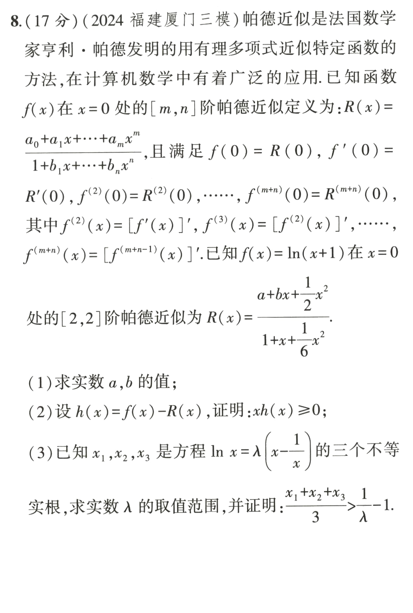
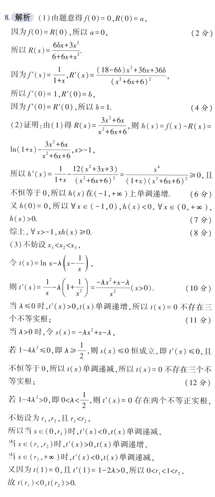
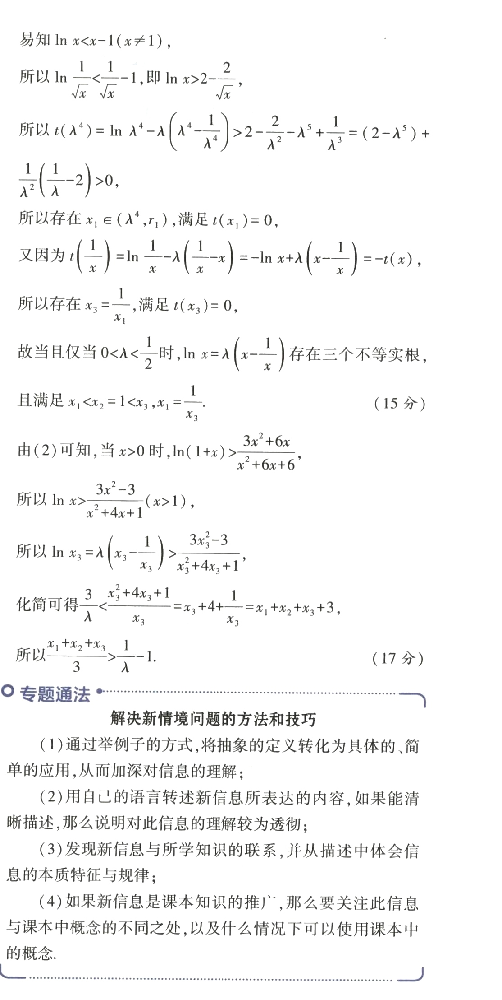
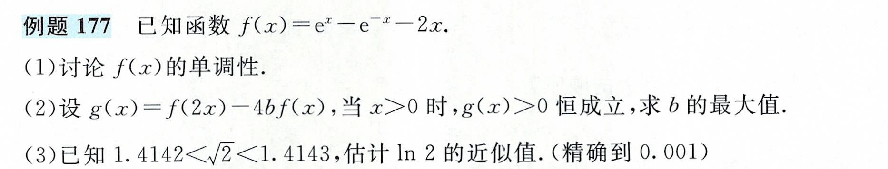
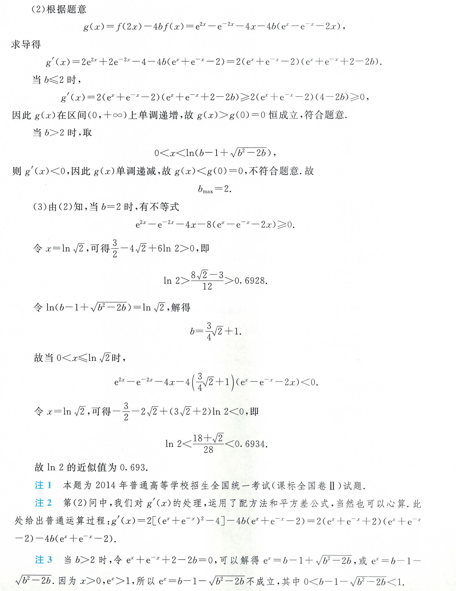
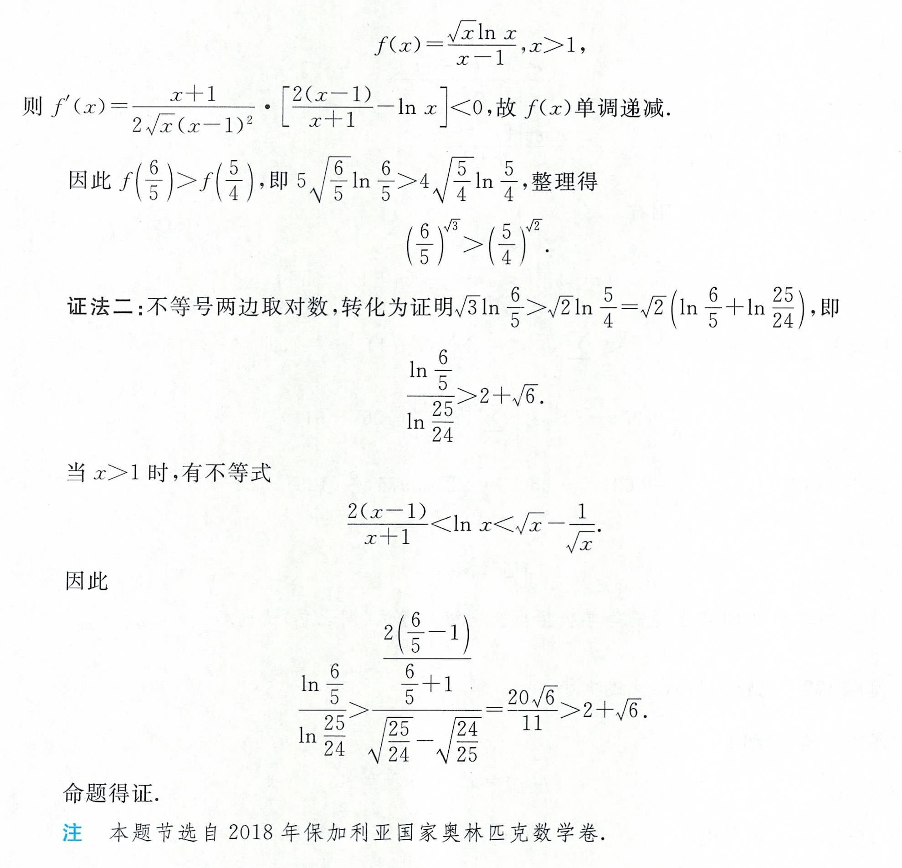

 
$$ 
\begin{cases}
\ln x\lt \frac{3(x^2-1)}{x^2+4x+1}, & 0 \lt x \lt 1 \\
\ln x\gt \frac{3(x^2-1)}{x^2+4x+1}, & x \gt 1
\end{cases}
$$

$$ 
\begin{cases}
\ln (x+1)\lt \frac{3x^2+6x}{x^2+6x+6}, & -1 \lt x \lt 0 \\
\ln (x+1)\gt \frac{3x^2+6x}{x^2+6x+6}, & x \gt 0
\end{cases}
$$

$$
\begin{cases}
\ln x\lt \frac{x^2+4x-5}{4x+2},\\
\ln (x+1)\lt \frac{x^2+6x}{4x+6}
\end{cases}
$$
关于$\ln x$和$\ln(x+1)$的不等式,可以由**平移**互相推出,所以**精度是一致**的.

{{<desmos funcs="y=\ln x|y=\frac{3(x^2-1)}{x^2+4x+1}|y=\frac{x^2+4x-5}{4x+2}" xmin="0" xmax="5" ymax="5" ymin="-5">}}

{{<desmos funcs="y=\ln (x+1)|y=\frac{3x^2+6x}{x^2+6x+6}|y=\frac{x^2+6x}{4x+6}" xmin="-1" xmax="4" ymax="5" ymin="-5">}}

注意,这些不等式只有在**接近取等条件**时精度才高,所以对于**偏离取等条件**的对数估值,可以进行**数值分拆**.

1. 估计$\ln 2$的近似值.(精确到0.001)

$$
\ln 2=\ln \frac{4}{3}+\ln \frac{5}{4}+\ln \frac{6}{5}\\
这里我们用\ln(x+1)的帕德逼近进行估值:\\
\ln \frac{4}{3}\lt \frac{(\frac{1}{3})^2+6(\frac{1}{3})}{4(\frac{1}{3})+6}=\frac{19}{66}\lt 0.2879\\
\ln \frac{5}{4}\lt \frac{(\frac{1}{4})^2+6(\frac{1}{4})}{4(\frac{1}{4})+6}=\frac{25}{112}\lt 0.2233\\
\ln \frac{6}{5}\lt \frac{(\frac{1}{5})^2+6(\frac{1}{5})}{4(\frac{1}{5})+6}=\frac{31}{170}\lt 0.1824\\
\ln 2\lt 0.2879+0.2233+0.1824=0.6936\\
\ln \frac{4}{3}\gt \frac{3(\frac{1}{3})^2+6(\frac{1}{3})}{(\frac{1}{3})^2+6(\frac{1}{3})+6}=\frac{21}{73}\gt 0.2876\\
\ln \frac{5}{4}\gt \frac{3(\frac{1}{4})^2+6(\frac{1}{4})}{(\frac{1}{4})^2+6(\frac{1}{4})+6}=\frac{27}{121}\gt 0.2231\\
\ln \frac{6}{5}\gt \frac{3(\frac{1}{5})^2+6(\frac{1}{5})}{(\frac{1}{5})^2+6(\frac{1}{5})+6}=\frac{33}{181}\gt 0.1823\\
\ln 2\gt 0.2876+0.2231+0.1823=0.6930\\
综上,\ln 2\approx 0.693\\
如果直接用Pade逼近,得到:\\
\ln 2\lt \frac{(1)^2+6(1)}{4(1)+6}=\frac{7}{10}=0.7\\
\ln 2\gt \frac{3(1)^2+6(1)}{(1)^2+6(1)+6}=\frac{9}{13}\gt 0.6923\\
精度是远远不够的
$$
题目出处及标答:

2. 证明:$(\frac{6}{5})^{\sqrt{3}}\gt(\frac{5}{4})^{\sqrt{2}}$

不等式两边取对数,得:

$$
\sqrt{3}\ln \frac{6}{5}\gt \sqrt{2}\ln \frac{5}{4}\\
由(1)中结论,\sqrt{3}\ln \frac{6}{5}\gt \sqrt{3}\frac{33}{181}\gt \sqrt{2}\frac{25}{112}\gt \sqrt{2}\ln \frac{5}{4}\\
这相当于:\\
\frac{3}{2}\gt (\frac{4525}{3696})^2\\
(\frac{4525}{3696})^2\lt (\frac{4525}{3695})^2=(\frac{905}{739})^2\lt 1.2247^2\lt 1.5\\
Q.E.D
$$

法一构造函数惊为天人(观察到30=6x5,20=5x4).

如果提前消去不等式两边相同的部分,就不需要Pade逼近这么高精度的放缩了.

3. 排序$a=2\ln 1.01,b=\ln 1.02,c=\sqrt{1.04}-1$

由琴生不等式:
$b+\ln 1\lt 2\ln 1.01$,故$b\lt a$

由伯努利不等式及$\ln x$切线:
$c\gt 0.04\times 2=0.02\gt b$

$a\lt 2\times 0.01\lt c$

综上:$b\lt a\lt c$