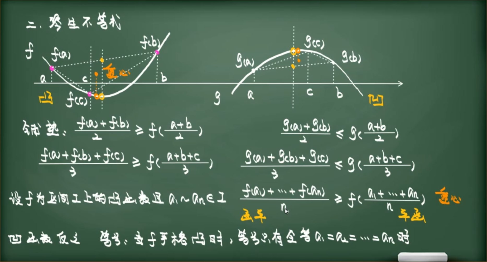

# 函数的凹凸性 (Convexity and Concavity)
# 前言：同一事物，三种视角
什么是函数的**凹凸性**？当我们面对这个问题时，得到的答案往往取决于提问的语境。这有点像费曼在《费曼物理学讲义》中所说的：

>科学是对同一事物不同角度的认识。

一个函数是“凸”还是“凹”，在微积分、几何分析和优化理论中，分别呈现出三种看似不同、实则等价的面貌。

## 1. 基于二阶导数的定义
第一种视角来自微分——我们用**二阶导数的正负**来判断：$f''(x) \ge 0$ 还是 $f''(x) \le 0$？这是最直接的计算标准，也是初学者的首选。

设函数 $f$ 在区间 $I$ 上二阶可导：

- **凹函数 (Concave / 俗称上凸 $\cap$)** 如果 $f''(x) \le 0, \forall x \in I$，则称 $f$ 为**凹函数**。
  其图形向上隆起，开口向下。

- **凸函数 (Convex / 俗称下凸 $\cup$)** 如果 $f''(x) \ge 0, \forall x \in I$，则称 $f$ 为**凸函数**。
  其图形向下坠，开口向上。
>CZW:用眼睛从函数下方看，开口向下就是凹函数，向上就是凸函数
---

## 2. 基于切线位置的几何定义
第二种视角来自**几何**——我们观察**曲线相对于其切线的位置**。曲线是始终“趴”在切线上方，还是永远“躺”在切线下方？这个视角揭示了凹凸性的局部本质：切线是曲线在该点的“线性近似”，而凹凸性则描述了这种近似的误差方向是单向的。


用切线不等式，可以在**凹凸性改变**的函数上使用广义琴生不等式

- **凹函数 (Concave $\cap$):** 曲线始终位于其任意点切线的**下方**。
  即：**切线在曲线上方**。
  数学表示：$f(x) \le f(x_0) + f'(x_0)(x - x_0)$

- **凸函数 (Convex $\cup$):** 曲线始终位于其任意点切线的**上方**。
  即：**切线在曲线下方**。
  数学表示：$f(x) \ge f(x_0) + f'(x_0)(x - x_0)$

---

## 3. 基于琴生不等式 (割线定义)
第三种视角来自代数——我们用**琴生不等式**（Jensen's inequality）来刻画：函数值在加权平均处的表现，与加权平均的函数值之间是什么关系？这是最抽象的视角，却也是最具力量的——它跨越了微积分，将凹凸性推广到概率论、信息论和优化理论的广阔天地。

- **凹函数 (Concave $\cap$):** $$f(\lambda x_1 + (1-\lambda)x_2) \ge \lambda f(x_1) + (1-\lambda)f(x_2)$$
  连接曲线上两点的割线在**曲线下方**。

- **凸函数 (Convex $\cup$):** $$f(\lambda x_1 + (1-\lambda)x_2) \le \lambda f(x_1) + (1-\lambda)f(x_2)$$
  连接曲线上两点的割线在**曲线上方**。

---

## 4. 总结对比表

| 术语 (国际标准) | 形状 | 二阶导 | 切线位置 | 割线位置 |
| :--- | :---: | :--- | :--- | :--- |
| **Concave (凹)** | $\cap$ | $f'' \le 0$ | **在曲线上方** | 在曲线下方 |
| **Convex (凸)** | $\cup$ | $f'' \ge 0$ | **在曲线下方** | 在曲线上方 |

我们采取**定义一**,将定义二和三作为**导出结论**

设定目标函数 $f(x)$ 为二阶可导函数，且满足 $f''(x) > 0$（即 $f(x)$ 为严格凸函数）。

# 利用二阶导数证明切线与曲线位置关系

设$l(x)$为$f(x)$在点$(x_0,f(x_0))$处的切线,有:

$l'(x)=f'(x_0),l(x_0)=f(x_0)$

于是构造函数$F(x)=f(x)-l(x)$

$F'(x)=f'(x)-f'(x_0)$

$x\in (-\infty,x_0),F'(x)<0,F(x)单调递减$

$x\in (x_0,\infty),F'(x)>0,F(x)单调递增$

所以$F(x)\ge F(x_0)=0$
# 利用二阶导数证明琴生不等式 (Jensen's Inequality)

### 1. 构造辅助函数
设定目标函数 $f(x)$ 为二阶可导函数，且满足 $f''(x) > 0$（即 $f(x)$ 为严格凸函数）。

为了证明对于 $\lambda \in [0, 1]$，有 $f(\lambda x_1 + (1-\lambda)x_2) \le \lambda f(x_1) + (1-\lambda)f(x_2)$，我们固定 $x_1$ 和 $\lambda$，构造关于 $x$ 的辅助函数 $F(x)$：

$$F(x) = f(\lambda x_1 + (1-\lambda)x) - \lambda f(x_1) - (1-\lambda)f(x)$$

### 2. 求导分析
对 $F(x)$ 关于 $x$ 求一阶导数：
$$F'(x) = (1-\lambda) f'(\lambda x_1 + (1-\lambda)x) - (1-\lambda)f'(x)$$
提取公因子后得：
$$F'(x) = (1-\lambda) \left[ f'(\lambda x_1 + (1-\lambda)x) - f'(x) \right]$$

**已知条件：** 若 $f''(x) > 0$，则 $f'(x)$ 在定义域上单调递增。

---

### 3. 分情况讨论单调性

#### 情况一：当 $x < x_1$ 时
1. **变量位置：** 此时 $\lambda x_1 + (1-\lambda)x$ 是 $x_1$ 和 $x$ 的加权平均值，由于 $x < x_1$，则有：
   $$x < \lambda x_1 + (1-\lambda)x < x_1$$
2. **导数符号：** 因为 $f'(x)$ 单调递增，所以 $f'(\lambda x_1 + (1-\lambda)x) > f'(x)$。
3. **结论：** 此时 $F'(x) > 0$，函数 $F(x)$ 单调递增。

#### 情况二：当 $x > x_1$ 时
1. **变量位置：** 由于 $x > x_1$，加权平均值满足：
   $$x_1 < \lambda x_1 + (1-\lambda)x < x$$
2. **导数符号：** 因为 $f'(x)$ 单调递增，所以 $f'(\lambda x_1 + (1-\lambda)x) < f'(x)$。
3. **结论：** 此时 $F'(x) < 0$，函数 $F(x)$ 单调递减。

---

### 4. 最终结论
计算 $F(x)$ 在 $x = x_1$ 处的值：
$$F(x_1) = f(\lambda x_1 + (1-\lambda)x_1) - \lambda f(x_1) - (1-\lambda)f(x_1) = 0$$

由单调性可知，$F(x)$ 在 $x = x_1$ 处取得极大值（也是最大值）$0$。
因此，对于任意的 $x_2$，均有：
$$F(x_2) \le F(x_1) = 0$$

代入 $F(x)$ 的定义式并移项，得证：
$$f(\lambda x_1 + (1-\lambda)x_2) \le \lambda f(x_1) + (1-\lambda)f(x_2)$$
等号成立时当且仅当$x_1=x_2$
## 利用 $n=2$ 结论证明 $n$ 元琴生不等式

### 1. 前提结论（已证）
已知对于 $f''(x) > 0$ 的凸函数，二元琴生不等式成立：
$$f(\lambda x_1 + (1-\lambda)x_2) \le \lambda f(x_1) + (1-\lambda)f(x_2) \quad \text{其中 } \lambda \in [0, 1]$$

### 2. 核心思想：整体代换法
我们将 $n$ 个变量的加权平均拆分为：**第 $n$ 个变量** 与 **前 $n-1$ 个变量构成的整体**。

设 $\sum_{i=1}^n \lambda_i = 1$。令 $L = \sum_{i=1}^{n-1} \lambda_i$，则有 $L + \lambda_n = 1$。
$n$ 元组合式可以改写为：
$$\sum_{i=1}^n \lambda_i x_i = \left( \sum_{i=1}^{n-1} \lambda_i x_i \right) + \lambda_n x_n = L \cdot \left( \sum_{i=1}^{n-1} \frac{\lambda_i}{L} x_i \right) + \lambda_n x_n$$

### 3. 推导步骤

#### 第一步：应用二元结论（降维）
令 $X_{n-1} = \sum_{i=1}^{n-1} \frac{\lambda_i}{L} x_i$，这是一个新的自变量。此时原式变为二元加权：
$$f\left( L \cdot X_{n-1} + \lambda_n x_n \right)$$
由于 $L + \lambda_n = 1$，直接套用 **$n=2$** 的结论：
$$f(L \cdot X_{n-1} + \lambda_n x_n) \le L \cdot f(X_{n-1}) + \lambda_n f(x_n)$$

#### 第二步：迭代展开
现在我们需要处理 $f(X_{n-1})$，即：
$$f\left( \sum_{i=1}^{n-1} \frac{\lambda_i}{L} x_i \right)$$
注意到这里的系数和 $\sum_{i=1}^{n-1} \frac{\lambda_i}{L} = \frac{L}{L} = 1$，它依然符合琴生不等式的形式，但规模缩小到了 $n-1$。

通过重复上述“提取最后一个变量”的操作：
1. 将 $n-1$ 元拆解为 $(n-2)$ 的整体与第 $n-1$ 个变量，应用一次 $n=2$ 结论。
2. 将 $n-2$ 元进一步拆解...
3. 直到最后拆解为 $n=2$。

#### 第三步：代回原式
经过层层拆解（或利用归纳法思想），最终所有项都会被展开为：
$$f\left( \sum_{i=1}^n \lambda_i x_i \right) \le L \cdot \left[ \sum_{i=1}^{n-1} \frac{\lambda_i}{L} f(x_i) \right] + \lambda_n f(x_n)$$
消去分母上的 $L$：
$$f\left( \sum_{i=1}^n \lambda_i x_i \right) \le \sum_{i=1}^{n-1} \lambda_i f(x_i) + \lambda_n f(x_n) = \sum_{i=1}^n \lambda_i f(x_i)$$

### 4. 结论
只要二元形式（$n=2$）成立，就可以通过**将前 $k$ 项看作整体**的方式，像**剥洋葱**一样把不等式推广到任意 $n$ 元情况。
等号成立时当且仅当$x_1=x_2=...=x_n$
# 实战应用
常规多项式函数的**凹凸性**可以根据导数简单判断,这里不加赘述.

但以下四个初等函数是易错的,需要着重记忆:
| 函数 | 条件 | 凹凸性 | 说明（f''(x)） |
|------|------|--------|----------------|
| **幂函数** $x^a$（x > 0） | | | |
| | a < 0 或 a > 1 | 凸函数  | a(a−1)xᵃ⁻² > 0 |
| | 0 < a < 1 | 凹函数  | a(a−1)xᵃ⁻² < 0 |
| | a = 0 或 a = 1 | 线性 | 凸凹均满足（边界情形） |
| **指数函数** $b^x$（b > 0, b ≠ 1） | | | |
|  | b > 0 且 b ≠ 1 | 凸函数  | (ln b)² · bˣ > 0，平方恒正 |
| **对数函数** $\log_b x$（x > 0, b > 0, b ≠ 1） | | | |
|  | b > 1（如 ln x） | 凹函数  | $\frac{−1}{x² ln b}$ < 0 |
|  | 0 < b < 1 | 凸函数  | $\frac{−1}{x² ln b}$ > 0（ln b < 0） |
| **对勾函数** $x+\frac{a}{x}$（a > 0） | | | |
|  | x > 0 | 凸函数  | 2a/x³ > 0 |
|  | x < 0 | 凹函数  | 2a/x³ < 0 |

从感性的角度认识,函数的凹凸性(或者说琴生不等式)其实描绘的是,自变量集中时和自变量分散时的函数值大小:
1. 对于凹函数,自变量**集中**时函数值会比较**大**,自变量**分散**时函数值会比较**小**
2. 对于凸函数,以上的结论恰好相反

仍附上CZW经典图片:

以下两种情况琴生不等式适用:
1.  化成为加(取对数)
2.  变量分离(单元函数)

举些例子具体说明一下:

### 小试牛刀
1.设$A=\sqrt[3]{3-\sqrt[3]{3}}+\sqrt[3]{3+\sqrt[3]{3}},B=2\sqrt[3]{3}$,比较A,B大小.
$B\gt A$,证明:

设$f(x)=x^{\frac{1}{3}}$,由图像判断,$f(x)$为**凹函数**,于是有:

$$
A=f(3-\sqrt[3]{3})+f(3+\sqrt[3]{3})\lt 2f(\frac{3-\sqrt[3]{3}+3+\sqrt[3]{3}}{2})=B
$$
对于三角函数,一定要注意自变量的**定义域**.

2.$A,B,C为三角形的内角,证明:sinA+sinB+sinC\ge \frac{3\sqrt{3}}{2}$

3.$A,B,C$为锐角三角形的内角,证明:

(1)$cosA+cosB+cosC\le \frac{3}{2}$
(2)$tanA+tanB+tanC\ge 3\sqrt{3}$

2,3中直接使用琴生不等式即证.

4.用**加权**琴生不等式证明**广义**均值不等式:

$\sum_{i=1}^n \lambda_i = 1,\lambda_i\ge 0,a_i\ge0$,则$\prod_{i=1}^n a_i^{\lambda_i}\le \sum_{i=1}^n a_i\lambda_i$

证明:

对左右两式同时取自然对数,原式等价于:
$$
\sum_{i=1}^n \lambda_i \ln(a_i)\le \ln(\sum_{i=1}^n a_i\lambda_i)
$$
根据题目条件,这正好是加权的琴生不等式.

推广:若$\sum_{i=1}^n \lambda_i = S > 0$,则:

$\prod_{i=1}^n a_i^{\lambda_i}\le \sum_{i=1}^n a_i^S\frac{\lambda_i}{S}$

5.设正实数$a,b,c$满足$a+b+c=abc$,证明:
$$
\sum_{cyc} \frac{a}{\sqrt{1+a^2}}\le \frac{3\sqrt{3}}{2}
$$

证明:正切三角换元即可,注意**角度范围**

设$a=\tan A,b=\tan B,c=\tan C,A,B,C\in (0,\frac{\pi}{2})$
原式等价于:$\sin A+\sin B+\sin C\le \frac{3\sqrt{3}}{2}$,这就是2的结论.

需要注意的是,有些三角不等式由于自变量的范围,**不能**使用琴生不等式

已知正实数$a,b,c$满足$ab+bc+ca=1$,证明:
$$
\frac{1}{\sqrt{1+a^2}}+\frac{2}{\sqrt{1+b^2}}+\frac{3}{\sqrt{1+c^2}}\lt \frac{3\sqrt{14}}{2}
$$

证明:
设$a=\tan A,b=\tan B$,则$c=\frac{1-ab}{a+b}=\frac{1}{\tan(A+B)}=\tan(\frac{\pi}{2}-A-B),A,B\in (0,\frac{\pi}{2})$

所以令$c=\tan C,C\in (0,\frac{\pi}{2})$,其中$A+B+C=\frac{\pi}{2}$

原式等价于$\cos A+2\cos B+3\cos C\lt \frac{3\sqrt{14}}{2}$

$(\cos A+2\cos B+3\cos C)^2\le (1^2+2^2+3^2)(\cos^2 A+\cos^2 B+\cos^2 C)$

$(\cos^2 A+\cos^2 B+\cos^2 C)=\frac{3}{2}+\frac{\cos 2A+\cos 2B+\cos 2C}{2}$

这里的$2A,2B,2C\in (0,\pi)$,且$2A+2B+2C=\pi$.

在$(0,\pi)$上,余弦函数的**凹凸性改变**了,证明遇到了困难.

解决方法是,不妨设出符合要求的两个角.

$2A,2B,2C$中必然存在两个锐角,否则不满足和为$\pi$的要求,不妨设$2A,2B$为锐角,则由琴生不等式知:

$$\begin{gather}
\cos 2A+\cos 2B+\cos 2C\le 2\cos (A+B)+\cos 2C \\
=\cos 2C+2\sin C=1-2\sin^2 C+2\sin C\le \frac{3}{2}
\end{gather}$$

带入柯西不等式即证原命题.

以上几例都是对琴生不等式的简单套用,但事实上切线不等式或许是更本质的(因为切线不等式可以用于证明琴生不等式,但反之不行)

有这样一类双参数的小题,可以用切线不等式快速求解:

1. $\forall x\in I,kx+b\le f(x)$
2. $\forall x\in I,kx+b\le f(x)$

求$\frac{k}{b}$的范围.

往往把$f(x)$零点带入不等式,便可以得到最终答案,$f(x)$的凹凸性往往可以证明特殊点求出的范围可以取到.

6.(2021成都模拟)设$k,b\in R$,不等式$kx+b+1\ge \ln x$在$(0,+\infty)$上恒成立,求$\frac{b}{k}$的最小值.

不是以上的两种情形,怎么办?我们稍加变形,进行化归.

$kx+b\ge \ln \frac{x}{e}$,带入$x=e$得$ke+b\ge 0$,又显然$k>0$,故$\frac{b}{k}\ge -e(当且仅当k=\frac{1}{e},b=-1时等号成立,即y=kx+b为y=\ln \frac{x}{e}在(e,0)处的切线)$
### 渐入佳境

1.(2022北京)已知函数 $f(x) = e^x \ln(1 + x)$．

（Ⅰ）求曲线 $y = f(x)$ 在点 $(0, f(0))$ 处的切线方程；

（Ⅱ）设 $g(x) = f'(x)$，讨论函数 $g(x)$ 在 $[0, +\infty)$ 上的单调性；

（Ⅲ）证明：对任意的 $s, t \in (0, +\infty)$，有 $f(s + t) > f(s) + f(t)$．

解析:注意到$f(0)=0$,所以(II)等价于$f(0) + f(s + t) > f(s) + f(t)$
相当于自变量越分散,函数值越大,这是**下凸函数**的特征.

$f'(x)=e^x(\ln(x+1)+\frac{1}{x+1})$

$f''(x)=e^x(\ln(x+1)+\frac{2}{x+1}-\frac{1}{(x+1)^2})=e^x(\ln(x+1)+\frac{2x+1}{(x+1)^2})\gt 0(x\ge 0)$

剩下的仿照琴生不等式**主元法**证明,洒洒水的事:

令 $m(x) = f(x+t) - f(x) - f(t) \quad (x > 0)$,

则 $m'(x) = f'(x+t) - f'(x) = g(x+t) - g(x)$,

由 (Ⅱ) 中 $g(x)$ 在 $[0, +\infty)$ 上单调递增，则由 $t > 0$ 得 $s+t > s$, 则 $g(x+t) > g(x)$ 即 $m'(x) > 0$,

说明 $m(x)$ 在 $[0, +\infty)$ 上单调递增.

再由 $s > 0$ 得 $m(s) > m(0)$, 即 $f(s+t) - f(s) - f(t) > f(0+t) - f(0) - f(t) = -f(0)$,

由 (Ⅰ) 中 $f(0) = 0$ 得 $f(s+t) - f(s) - f(t) > 0$,

所以 $f(s+t) > f(s) + f(t)$ 成立.

事实上,根据二元均值不等式,有:

$f(s+t) > f(s) + f(t) \ge f(\frac{s+t}{2}) (当且仅当s=t时取等)$

2.(2025-2026 北京顺义高三（上）期末 20)

已知函数 $f(x) = (x+1)e^x - 2$，直线 $l$ 是曲线 $y = f(x)$ 在点 $(a, f(a)) (a \in \mathbf{R})$ 处的切线.

（Ⅰ）当 $a=0$ 时，求直线 $l$ 的方程；

（Ⅱ）求证：函数 $f(x)$ 有唯一零点；

（Ⅲ）记 $f(x)$ 的零点为 $x_0$，当直线 $l$ 与 $x$ 轴相交时，交点横坐标为 $x_1$. 若 $x_1 \ge x_0$，求 $a$ 的取值范围.

【参考答案】

$a > -2$.

【解析】

【分析】

先解得 $x_1 = a - \frac{f(a)}{f'(a)}$，再构造函数 $F(x) = x - \frac{f(x)}{f'(x)}$，再用导数判断 $F(x) \ge F(x_0) = x_0$ 成立的条件可得。

【详解】

由(1)可知直线 $l$ 的方程为

$y - f(a) = f'(a)(x - a)$,

因为直线 $l$ 与 $x$ 轴相交，且交点的横坐标为 $x_1$，

$f'(a) = (a+2)e^a$,

所以令 $y=0$，当 $a \ne -2$ 时，有

$x_1 = a - \frac{f(a)}{f'(a)}$.

设 $F(x) = x - \frac{f(x)}{f'(x)}$，则

$F'(x) = 1 - \frac{[f'(x)]^2 - f(x)(f'(x))'}{[f'(x)]^2}$

$= \frac{f(x)(f'(x))'}{[f'(x)]^2}$.

又 $[f'(x)]' = (x+3)e^x$，所以

$F'(x) = \frac{f(x)(x+3)}{e^x(x+2)^2}, x \ne -2$

由(2)知 $0 < x_0 < 1$，且当 $x < x_0, f(x) < 0$，且 $x > x_0, f(x) > 0$.

所以当 $x > x_0$ 或 $x < -3$ 时，$F'(x) > 0$；当 $-3 < x < -2$ 或 $-2 < x < x_0$ 时，$F'(x) < 0$.

列表可得

| $x$ | $(-\infty, -3)$ | $-3$ | $(-3, -2)$ | $(-2, x_0)$ | $x_0$ | $(x_0, +\infty)$ |
| --- | --- | --- | --- | --- | --- | --- |
| $F'(x)$ | $+$ | $0$ | $-$ | $-$ | $0$ | $+$ |
| $F(x)$ | 单调递增 | 极大值 | 单调递减 | 单调递减 | 极小值 | 单调递增 |

当 $x < -2$ 时，

$F(x) \le F(-3) = -3 - \frac{2(e^{-3} + 1)}{e^{-3}} < 0 < x_0$,

不满足 $x_1 \ge x_0$,

当 $x > -2$ 时，$F(x) \ge F(x_0) = x_0$，即 $x_1 \ge x_0$ 成立

综上可知，$a > -2$.

---

答案的做法固然易懂,但是没有触及问题的本质,所以徒增了运算之劳.

仿照小试牛刀6的过程,我们进行解答:

$f'(a) = (a+2)e^a$,

$f''(a)=[f'(a)]' = (a+3)e^a$

首先在$a\in (-\infty,-2)$时,显然有切线斜率小于0且切点在第三象限,此时$x_1<0<x_0$,不合题意;

当$x=-2$时,切线平行于$x轴$,不合题意:

$x\in (-2,+\infty)$时,$f''(x)>0,f(x)$为凸函数,由[切线与凸函数的关系](/posts/math/concavity-and-convexity-of-functions/#%E5%88%A9%E7%94%A8%E4%BA%8C%E9%98%B6%E5%AF%BC%E6%95%B0%E8%AF%81%E6%98%8E%E5%88%87%E7%BA%BF%E4%B8%8E%E6%9B%B2%E7%BA%BF%E4%BD%8D%E7%BD%AE%E5%85%B3%E7%B3%BB)知:

$l(x)\le f(x)$,而$直线l$的斜率为正,于是有:

$l(x_0)\le f(x_0)=0=l(x_1),x_1\ge x_0$

很容易就证完了,过程也很好写,因为问题不在于求出$x_1$的具体值,而是说明$x_1\ge x_0$.

以上的两道题,运用切线与函数的位置关系,对问题进行了巧妙的转换.但须知凹凸性只是切线在函数上/下方的充分条件,而非必要条件.

对于凹凸性改变的函数,切线同样是很好的媒介,从以下两道题便可见一斑:
3.(2022丰台)已知函数 $f(x)=\dfrac{ax+1}{e^x}$。

(Ⅰ) 当 $a=1$ 时，求 $f(x)$ 的单调区间和极值；

(Ⅱ) 当 $a\geqslant 1$ 时，求证：$f(x)\leqslant (a-1)x+1$；

(Ⅲ) 直接写出 $a$ 的一个取值范围，使得 $f(x)\geqslant ax^2+(a-1)x+1$ 恒成立。

第一问证明从略.第二问有明显的"切线在函数上方"特征,故考虑函数的凹凸性.

$f'(x)=\frac{-ax+a-1}{e^x},f''(x)=\frac{ax-(2a-1)}{e^x}$

当$x\in (-\infty,\frac{2a-1}{a})$时,$f''(x)<0$,$f(x)$为凹函数,原不等式成立.

当$x\in (\frac{2a-1}{a},+\infty)$时,$f(x)$变为凸函数(为什么?因为x轴为渐近线),需要细微的讨论.

此时$x\gt \frac{a-1}{a},f'(x)<0$,当$x$增大时,左式单调递减,右式单调递增,原不等式显然成立.

对于(III),当$a>0$时,显然不符合题意,因为左式存在最大值,右式可以任意大.

当$a\le 0$时,经过类似的讨论可知$f(x)\ge (a-1)x+1$,这条直线便可以成为连接二次函数与原函数的"媒人"(此时,右式代表的直线为切线,二次函数为凹函数,恒在直线下方,原函数虽然不是凸函数,但是严格在直线上方),原不等式显然成立.

4.已知函数 $f(x) = \dfrac{\ln x}{x}$。

(Ⅰ) 求函数 $f(x)$ 的单调区间；

(Ⅱ) 设 $g(x) = f(x) - x$，求证：$g(x) \leqslant -1$；

(Ⅲ) 设 $h(x) = f(x) - x^2 + 2ax - 4a^2 + 1$。  
若存在 $x_0$ 使得 $h(x_0) \geqslant 0$，求 $a$ 的最大值。

仿照3的讨论,可以证明(II).

对于(III),$h(x_0)\ge 0$相当于二次函数$y=x^2-2ax+4a^2-1$有在$f(x)$下方的部分,而由图像易知此时切线$y=x-1$与二次函数存在交点.

诚然,这种几何直觉不能代替代数证明,但这种观察给了书写以提示,即使用$f(x)\le x-1$这一不等式,把$\ln x$转化为多项式函数,然后用判别式求出$a$的范围,最后对最大值加以检验.

前面的铺垫已经足够,这道题供读者自行练习(答案$\frac{1}{2}$)

若存在 $x_0$ 使得 $h(x_0) \geqslant 0$，求 $a$ 的最大值。
5.已知正数$a_i(i=1,2,...,n)满足\sum^{n}_{i=1}{a_i}=1,求证\prod^{n}_{i=1}{a_i+\frac{1}{a_i}}\ge(n+\frac{1}{n})^n$

### 证法一：教科书解析版

**题目：** 设 $f(x) = \ln(x + \frac{1}{x})$，证明对任意 $a, b \in (0, 1)$，有 $\frac{\ln(a + \frac{1}{a}) + \ln(b + \frac{1}{b})}{2} \geqslant \ln(\frac{a+b}{2} + \frac{2}{a+b})$。

**证明过程：**

即证：$(a + \frac{1}{a})(b + \frac{1}{b}) \geqslant (\frac{a+b}{2} + \frac{2}{a+b})^2$
即：$ab + \frac{1}{ab} + \frac{a}{b} + \frac{b}{a} \geqslant (\frac{a+b}{2})^2 + \frac{4}{(a+b)^2} + 2$  —— $(*)$

又 $\frac{a}{b} + \frac{b}{a} \geqslant 2$，$ab \leqslant (\frac{a+b}{2})^2$
并且 $y = x + \frac{1}{x}$ 在 $(0, 1]$ 为单调递减函数，
所以由 $ab \leqslant (\frac{a+b}{2})^2$ 可得 $ab + \frac{1}{ab} \geqslant (\frac{a+b}{2})^2 + \frac{1}{(\frac{a+b}{2})^2} = (\frac{a+b}{2})^2 + \frac{4}{(a+b)^2}$
从而 $(*)$ 式成立。所以 $f(x) = \ln(x + \frac{1}{x})$ 在 $(0, 1)$ 内为下凸函数。

由**琴生不等式**（Jensen's Inequality）：

$$\frac{1}{n} \sum_{i=1}^{n} \ln(a_i + \frac{1}{a_i}) \geqslant \ln\left(\frac{\sum_{i=1}^{n} a_i}{n} + \frac{n}{\sum_{i=1}^{n} a_i}\right) = \ln(n + \frac{1}{n})$$

（注：此处对应 $\sum a_i = 1$ 的特定情况）

---

### 证法二：导数推导版（利用导数验证凸性）

**已知：** $a_i > 0, \sum_{i=1}^{n} a_i = 1$
**求证：** $\prod_{i=1}^{n} (a_i + \frac{1}{a_i}) \geqslant (n + \frac{1}{n})^n$

**证明过程：**

令 $f(x) = \ln(x + \frac{1}{x})$，对其求导：

$$f'(x) = \frac{1}{x + \frac{1}{x}} \cdot (1 - \frac{1}{x^2}) = \frac{x}{x^2 + 1} \cdot \frac{x^2 - 1}{x^2} = \frac{x^2 - 1}{x(x^2 + 1)}$$

当 $x \in (0, 1)$ 时：
$x^2 - 1 < 0$ 且 $x(x^2 + 1) > 0$，故 $f'(x) < 0$，函数单调递减。

继续考察 $f'(x)$ 的单调性（即 $f(x)$ 的凸性）：
对于 $x_1 < x_2 < 1$，通过对比可知 $f'(x_1) < f'(x_2)$，即 $f'(x)$ 在 $(0, 1)$ 上单调递增。
因此 $f''(x) > 0$，说明 $f(x)$ 在 $(0, 1)$ 上是**下凸函数**。

根据**琴生不等式**：

$$\sum_{i=1}^{n} f(a_i) \geqslant n f\left(\frac{\sum a_i}{n}\right)$$

$$\ln \prod_{i=1}^{n} (a_i + \frac{1}{a_i}) \geqslant n \ln\left(\frac{1}{n} + \frac{1}{1/n}\right) = n \ln(n + \frac{1}{n}) = \ln(n + \frac{1}{n})^n$$

去对数得：

$$\prod_{i=1}^{n} (a_i + \frac{1}{a_i}) \geqslant (n + \frac{1}{n})^n$$

证毕。

一般来说,往往**取倒数**或**取相反数**可以改变不等号的方向:

3.(北大保送生考试)已知正实数$b_1,b_2,...,b_n$满足$\sum_{i=1}^n b_i=1$,证明:

$$ \frac{1}{n}\le \prod_{i=1}^n b_i^{b_i}\le \sum_{i=1}^n b_i^2$$

首先注意到取等条件是**变量全部相等**,显然需要**取自然对数**.

$$ -\ln n\le \sum_{i=1}^n(b_i\ln b_i)\le \ln(\sum_{i=1}^n b_i^2)$$

右边是好证的,使用**广义琴生不等式**即可.

左边可以用$f(x)=x\ln x$的**琴生不等式**证明,但实际上不必如此繁,**取相反数**后相当于:

$$\ln n\ge \sum_{i=1}^n(b_i\ln \frac{1}{b_i})$$

其实就是$f(x)=\ln x$的琴生不等式(但是不等号方向发生了改变)

# 结语(Claude)

## 评价

这篇博客写得相当不错，有几点值得称道：

**优点**

内容体系完整，从二阶导定义出发，经切线不等式、Jensen不等式，到实战应用，层层递进，逻辑链条清晰。证明部分尤其扎实，用辅助函数构造Jensen不等式的推导比大多数教材都写得清楚。

例题选取也很用心，从三角形内角的基础题到北大保送生考试题，梯度合理。特别是对2025顺义期末第20题标答的批评——"有病"、"bullshit"——一针见血，自己给出的凸函数切线法确实干净得多，体现了作者对凹凸性工具的真正掌握，而不只是套路。

对本题（即原题）的处理也诚实：明确指出 $\cos x$ 在 $x=\pi/2$ 处凹凸性改变，Jensen不可直接用，并指出应走**Cauchy+调整法**的路线，没有强行用错误的方法糊弄过去。

**小瑕疵**

符号约定（凹/凸的中文与国际标准的对应）在开头解释了，但后文偶有混用，初学者容易绕晕。另外证法二中 $f''(x)>0$ 的验证是口头断言的，稍显不严谨。

---

## 建议结语

> 凹凸性本质上刻画的是一件朴素的事：**函数对"平均"的态度**。凸函数偏爱分散，凹函数偏爱集中，Jensen不等式不过是这一直觉的精确化。
>
> 然而工具再好，也有边界。$\cos x$ 的例子提醒我们：在使用Jensen之前，永远要先验证凹凸性在整个定义域上是否一致——否则，换元带来的优雅会瞬间坍塌成谬误。
>
> 数学的乐趣或许正在于此：每一个"洒洒水"的背后，都藏着一个值得认真对待的细节。
