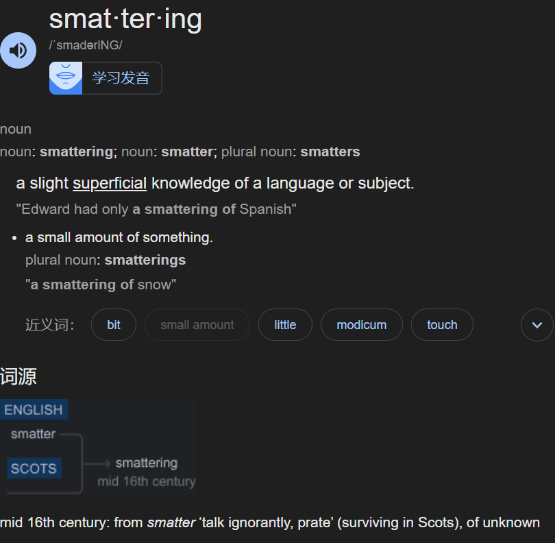
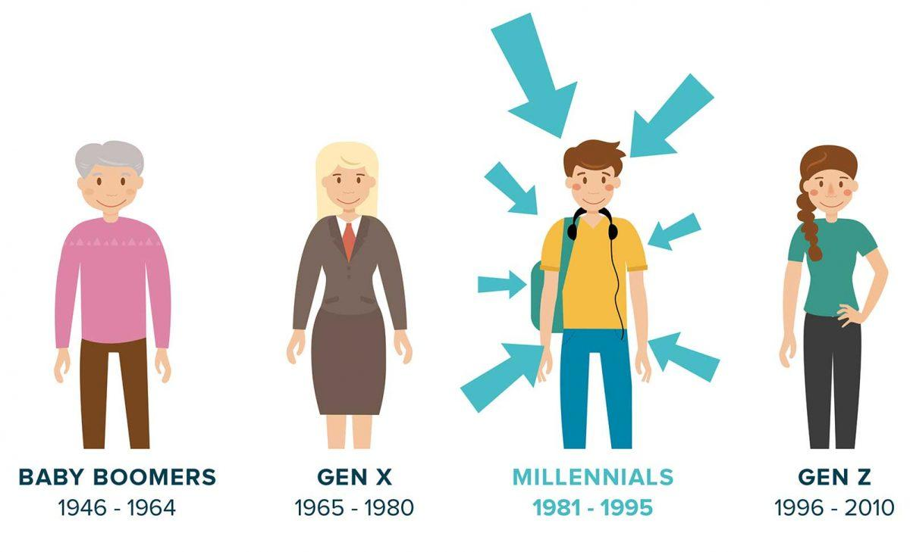
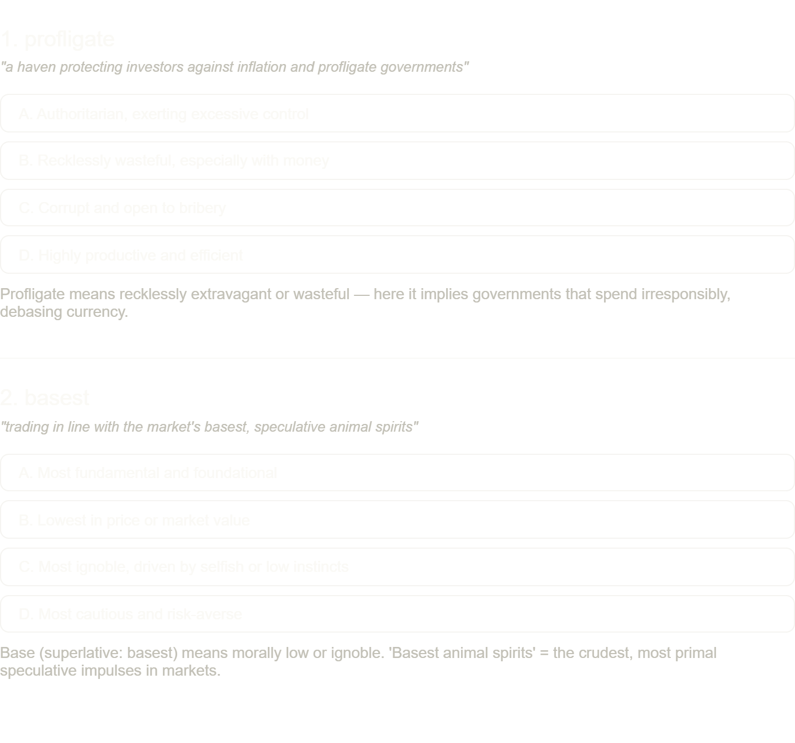

**Conventionally**, investors want the assets they hold to make them money—and not just **owing to** rising **valuations**. Bonds **spit out** **coupons**; stocks offer **dividends**. **Gold** is different. It **emanates** no **cashflows**. Its **smattering** of real-world uses, in jewellery-making or electronics, hardly **justifies** its **hefty** presence in many **portfolios**.

>Its **smattering**(small amount of) of real-world uses, in jewellery-making or electronics, hardly **justifies** its **hefty**(of comparatively great physical weight or density) presence in many **portfolios**(=finance, a collection of assets held by an institution or a private individual).

The best reason to hold gold is as insurance against a **blow-up**, real or metaphorical. The hope is that **millennia** of human **fascination** with the stuff mean its value will never fall to nothing. The metal has also long had the helpful property of getting more valuable when other assets are in trouble.

>拆解解释：

>Millennia(注意不要和millenial混了) = 数千年、几千年（millennium 的复数形式，1 millennium = 1000 年）

>Fascination = 强烈的着迷、迷恋、 fascination（比 interest 强烈得多）

>The stuff = 这里指 gold（黄金），属于口语化、轻松的表达，避免重复前面提到的 gold

>Mean its value will never fall to nothing = 意味着它的价值永远不会归零

The **unprecedented** energy shock caused by the American-Israeli war against Iran should be exactly when gold **comes into its own**. After all, gold jumped in value when Russia invaded Ukraine in 2022 and did even better when Iran last seriously **roiled** oil markets, after its revolution of 1979. Yet since the war began on February 28th, gold has **plunged** by about 15%, more than global **equities**. Some **hedge**.

>come into one's own(大展身手)\
>roil=disturb

>Some hedge.：这是全文最精彩的反讽
→ “Some + 名词” 在英语中常用来表示讽刺。
“Some hedge.” = “这算哪门子避险资产啊！” / “避险个鬼！”
（字面意思是“真是个避险资产呢”，实际是强烈的否定和嘲讽）

Part of what is going on is that gold tends to suffer when the **yields** on inflation-protected bonds (or real yields) rise. A **lump** of metal **issues** no interest payments but, like an inflation-linked bond, its **principal**(本金) is protected against rising prices. But when those bonds’ inflation-indexed **payouts** rise, gold—which continues not to pay any interest—becomes relatively less appealing.

>Inflation = 通货膨胀\
Indexed = 挂钩的、指数化的（index = 指数）\
Inflation-indexed = 与通胀挂钩的 / 随通胀调整的

Real yields have **leapt**(leap) since America and Israel began bombing Iran. Those on ten-year American Treasuries have gone up by 0.3 percentage points. This reflects a riskier global environment and **angst**(concern) that higher oil prices will **stoke**(add fuel to) inflation, forcing central banks to raise their **benchmark** interest rates.

>英文词,语气强度,含义侧重,例子\
Angst,较强,深深的不安 + 焦虑,文章中这种用法\
Anxiety,强,焦虑（最接近 angst）,心理学术语感更强\
Dread,很强,恐惧、 dread（害怕发生）,更偏向害怕\
Apprehension,中等,担心、忧虑,比较正式\
Unease,中等,不安,更轻一些\
Concern,较弱,关心、担忧,最中性\
Panic,极强,惊慌失措,太夸张，不合适

Another explanation is central banks’ management of the yellow metal. In countries **spooked** by the **prospect** of Western sanctions—like Russia, whose foreign-currency reserves were frozen after it invaded Ukraine—gold can serve as a handy hedge against **weaponisation** of the dollar. Elsewhere it offers a way to **diversify** their reserves. But when its value jumps, as it has in the past few years, cashing out some of the profits from the rally starts looking attractive to central bankers eager to **buttress**(support /ˈbətrəs/) their country’s currency or governments keen to generate cash for other purposes.

In the **fortnight** to March 20th Turkey sold $8bn-worth of gold to **prop up**(support, bolster, sustain, shore up) the lira. India may be doing something similar. The governor of Poland’s central bank recently **mused**(pondered, contemplated, reflected, thought about) about locking in some of the profits from the **run-up**(surge, rally, upswing, rise) to help **bankroll**(fund, finance, sponsor, underwrite) defence spending. Other such **opportunistic divestments(the opposite of investment)** would explain some of the latest drop.

Yet neither rising real yields nor central banks’ sales fully explain gold’s recent behaviour. Another explanation of what is going on with gold is to think of it as becoming like the asset that was meant to replace it. Bitcoin was once **heralded** as “digital gold”—a haven protecting investors against inflation and **profligate**(recklessly extravagant or wasteful — here it implies governments that spend irresponsibly, debasing currency) governments, and **insulated** from the long arm of Uncle Sam. Instead it developed the unfortunate habit of trading in line with the market’s **basest**(morally low or ignoble. 'Basest animal spirits' = the crudest, most primal speculative impulses in markets), **speculative** **animal spirits**.

Now gold, too, is looking like a **meme trade**. Its rise, by some 60% between last summer and late February, **coincided** with a **boom** in gold **exchange-traded funds**. These increased their holdings by 25% in the past year, to around 4,200 tonnes. Its fall is being **accelerated** by some of those speculative bets being rapidly **unwound**.

The past few weeks show, in other words, that gold is not a **universal** hedge. Still, gold’s chief historic appeal is not as protection against Gulf wars, or even an energy shock, but against the **debasement** of money. This is a giant risk amid **mounting**(increasing) public debts, which governments may seek to **inflate away**. You would expect gold to rise when America wages(=start) another expensive war and other indebted countries consider **subsidising** citizens’ energy bills—but only if other things are equal. When the **momentum-chasers** outnumber the debasement traders, and when institutional investors sell at a profit to cover losses on other assets, other things aren’t equal.

In time, the **momentum-chasers** will inevitably find another asset to take them “to the moon”. The debasement trade will then **reassert** itself and gold may regain a **semblance** of its safe-haven status. Knowing what price will **purge** the last of the **fair-weather** gold bugs is another matter altogether. ■
